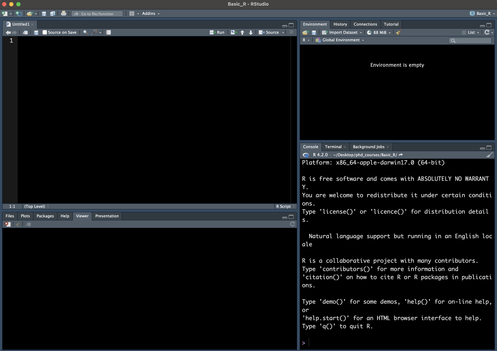

```{r setup, include=FALSE}
options(htmltools.dir.version = FALSE)
```

---
class: middle

# About this workshop

1. Introduction to R programming
2. Conduct statistical analysis using R
3. Prepare for LHS 610 

---
class: middle

# Topics

1. Basic R and Data Manipulation -- Angela and Zhe 
2. Statistical Analysis
3. Data Visualization -- Angela

---
class: middle

# Contact 

* Angela Wiley 
  + contact: amwiley@umich.edu

* Zhe Zhao 
  + contact: zzhaozhe@umich.edu

---

class: middle

# Prerequisite

1. Please download R from: https://www.r-project.org/
2. Please download RStudio from: https://posit.co/download/rstudio-desktop/#download

---

class: middle

# Acknowledgement

Today's materials are adapted from R workshops offered by Consulting for Statistics, Computing & Analytics Research (CSCAR), which is taught by Xiru Lyu. Please refer to CSCAR website for more information: https://cscar.research.umich.edu/.

---

# Today's Agenda

1. What is R?
2. Getting started with R
  + R session
  + Data types
  + Data structures
3. Subset selection

---

class: middle

# What is R

* R is a free software environment for statistical computing and graphics.

---

# Why using R

1. It's **FREE**
2. One of the leading languages for statistical computing
3. Beautiful graphical display 
4. Open-sourced packages
5. High level language
  + more understandable compared to C or C++
  
---

R code:
```{r eval=FALSE, tidy=FALSE}
# Calculate average for a list of numbers
numbers <- c(10, 20, 30, 40, 50)
average <- mean(numbers)
print(average)
```

--

C code
```{c eval=FALSE, tidy=FALSE}
int main() {
  int numbers[] = {10, 20, 30, 40, 50};
  int num_elements = sizeof(numbers) / sizeof(numbers[0]);

  int sum = 0;
  for (int i = 0; i < num_elements; i++) {
    sum += numbers[i];
  }

  double average = (double) sum / num_elements;

  printf("%.2f\n", average);

  return 0;
}
```


---

# RStuidio

RStudio in an integrated development environment (IDE) for R.



---

class: middle

# Getting Started with R

---

# R Session

Type in the editor window

```{r}
print("hello DLHS")
```

Algebraic Operation

```{r eval = FALSE}
5+3
5-3
5*3
5/3
5^3

5 %% 3 # remainder
17 %/% 5 # integer division

# functions
sqrt(8)
exp(5)
log(100)
```

---

# creating objects

What can we do with an object?

```{r}
result = 5 * 3
result <- 5 * 3
```

The value `5*3` has been assigned to the varaible `result`.

```{r}
result - 1
```

```{r}
result2 = result / 20
print(result2)
```

If we don't want `result` anymore

```{r}
rm(result)
```


---
# Data Types

.custom[
* double: <span style="color:blue">2.5, 10</span>
  + float
  + a float is 32 bits in size while a double is 64 bits. A double is twice the size     of a float — thus the term double.
* integer: <span style="color:blue">2L, 10L</span>
* logic: <span style="color:blue">TRUE, FALSE</span>
  + Abbreviation: <span style="color:blue">T, F</span>
* Character/String: <span style="color:blue">"Angela", "Zhe"</span>
* Missing Value: <span style="color:blue">NA</span>
  + <span style="color:blue">NA\_real_, NA\_integer_, NA\_character_</span>
]


---

# Some Tips

.custom[Using Algebraic Operation to create logic object]
```{r}
5>6
```

```{r}
a = 100
b = Inf
condition = a < b
print(condition)
```

---

# Some Tips

We can use `class()` or `typeof()` to check the data type of an object
```{r}
typeof("DLHS")
```

```{r}
class("DLHS")
```

--

`is` functions will return logic values when checking data types
```{r}
is.numeric(123)
```

```{r}
is.integer(2L)
```

---

# Data Structures

* Vector
  + can only hold one data type

* List
  + can hold multiple data types

---

# Vectors and Lists

Vectors:

```{r}
a = c(1, 2, 3)
```
```{r}
a = c(1, "2", 3)
class(a)
```

Lists:

```{r}
a = list(1, "a", 1L, TRUE)
b = list(c(1, 2, 3), c("a", "b", "c"))
class(a); class(b)
```

---

# Matrices and Arrays

.custom[
* A matrix and an array is a vector with dimensions
* A matrix has 2 dimensions; an array can have any number of dimensions
]

---

# Matrices and Arrays

Matrix
```{r}
matrix(1:12, nrow = 4, ncol = 3)
```

```{r}
matrix(1:12, nrow = 4, byrow=TRUE)
```

---

# Matrices and Arrays

Three-dimension Arrray

```{r}
array(1:12, dim=c(2,3,2))
```

---

class: middle

# Subsetting

---

# Subsetting Vectors

Using position numbers for simple subsetting
```{r}
vec = c(7,8,9,10)
vec[4]
```

Select multiple elements
```{r}
vec[c(2,3)]
```

Delete elements
```{r}
vec[-1]
```

---

# Subsetting lists

Using single bracket `[ ]` will return a new list
```{r}
lst = list("Angela", "Dalton", "Phil", c("Zhe", "DLHS"))
lst[1]
```

To access elements, we need to use double brackets `[[ ]]`
```{r}
lst[[2]]
```


```{r}
lst[[4]][1]
```

---

# Subsetting matrices

Remember a matrix has two dimensions. 
```{r}
mat = matrix(1:12, nrow = 3)
print(mat)
```

```{r}
mat[1,]
```

```{r}
mat[3, 2]
```

---

# Named Lists
```{r}
lst = list("Angela" = 4, "Dalton" = c(1,2,3))
```

We can use charater strings to subset a named list

```{r}
lst[["Dalton"]]
```

This also applies to named vectors and Dataframes (We will learn more about it later!). 

---
# Index Assignment

If we want to change specific elements within an object

* Vector
```{r}
vec = c(1,2,3)
vec[1] = 8
print(vec)
```

* List
```{r}
lst = list("a", "b")
lst[[1]] = "z"
print(lst)
```

---
# Index Assignment

* Matrix
```{r}
mat = matrix(1:12, nrow = 3)
mat[1,] = c(10, 11, 12, 13)
print(mat)
```

---
# Next

**Programming in R**


