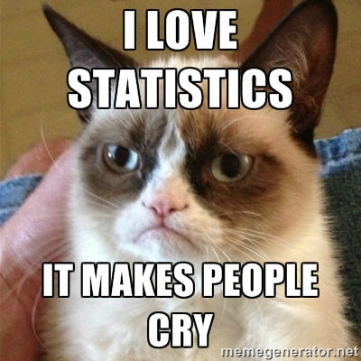

```{r setup, include=FALSE}
options(htmltools.dir.version = FALSE)
```

---
# Today's Agenda

4. Programming in R
  + Conditional statement
  + loops
  + Functions
5. Dataframe
  + Data manipulation
  
---
class: middle

# Programming in R

---

# Conditional Statement

Using `if...else if...else` for decision making in R programming

```{r}
x = 5
if(x<5){
  print("Less than five")
} else if(x == 5) {
  print("Equals five")
} else{
  print("Greater than five")
}
```

--

Note: `else if` and `else` are optional

```{r}
if(x == 5) {
  print("Equals five")
}
```

---

# Conditional Statement

We can also use a single line code to create a conditional statement.

```{r}
x = -9
ifelse(x < 0, print("Negative"), print("Positive"))
```

---

# Loops

We can use loops to repeat an action over a sequence


### For Loops

```
for (value in a sequence) {
  execute a command
}
```

### while Loops

```
while (conditional statement) {
  execute a command
}
```

---

# For loops

```{r}
for (x in -1:2) {
  if(x<0){
    print("Negative")
  } else if(x == 0) {
    print("Zero")
  } else{
    print("Postive")
  }
}
```


---

# While Loops

```{r}
a = 100

while (a > 95) {
  print(a)
  a = a - 1
}
```


---


# While Loops

Be careful about `while` loops. Playing wild card may create an endless loop

```
a = 1
while(TRUE){
  print(a)
  a = a + 1
}
```

--

Use `break` to break a loop
```{r}
a = 1
while(TRUE){
  print(a)
  a = a + 1
  
  if(a>3){
    break
  }
}
```

---

# Functions

.custom[
* A function is a set of statements organized together to perform a specific task. It is useful if we don't want write same codes again and again.
* R has a huge set of built-in functions
]

```{r}
a = c(1,2,3)
sum(a)
```

```{r}
exp(a)
```

```{r}
sqrt(a)
```

---
class: middle

# User-defined Function

```
function_name = function(arg1, arg2, ...) {
  execute a command for arg1, arg2, ...

  return(final product)
}
```

---

# User-defined Function

Let’s try to write a function that converts Fahrenheit (F) to Celsius (C) using the formula

$$C = \frac{5}{9}(F-32)$$

```{r}
fahrenheit_to_celsius = function(F){
  C = (F - 32)*5/9
  return(round(C, digits = 1))
}

fahrenheit_to_celsius(80)
```

```{r}
fahrenheit_to_celsius(100)
```

---

class: middle

# Data Frame

---

# What are Data Frames

Data Frames are data displayed in a format as a table.

Data Frames can have different types of data inside it. While the first column can be character, the second and third can be numeric or logical. However, each column should have the same type of data.

In R, we call this type of variable `data.frame`.

```{r data frame}
data("iris")
class(iris)
```

---

# Create a Data Frame

Use `data.frame()` function to create a data frame in R.

```{r}
df = data.frame(
  id = c(1,2,3),
  department = c("LHS", "Biology", "Education"),
  height = c(168, 183, 178)
)

print(df)
```

---

# Summary Data Frames

```{r}
summary(iris)
```

---

# Summary Data Frames

```{r}
dim(iris)

ncol(iris)

nrow(iris)
```

---

# Accessing Columns within a Data Frame

```{r}
df$id

df[, "department"]

df[["height"]]

df[, 1]

df[1]
```


---

# Accessing Rows within a Data Frame

```{r}
df[1, "department"]

df[2, 1]

df[3, ]
```

---

# Add Items

```{r}
new_row = c(1, "Informatics", 182)
rbind(df, new_row)
```

```{r}
grades = c("A", "A", "A+")
cbind(df, grades)
```

---
# Next

**Statistical Analysis Using R**

